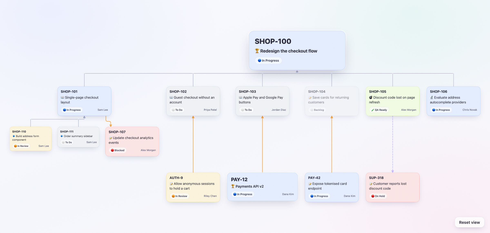

# Jira Visualizer

Turns a Jira epic into an interactive dependency map. It fetches every open issue under the epic, follows
their links, and writes a single self-contained HTML page you can pan, zoom and click through.



## What it shows

- The epic at the top, with its child issues laid out in a tree beneath it
- Blocking links (orange) and "causes" links (dashed purple) between issues, including issues outside the epic
- Each card's key, summary, type, status and assignee, linking back to Jira
- Blocked issues are placed under the issue blocking them, so the order work has to happen in reads top to bottom

Done, Closed and Resolved issues are left out.

## Setup

Requires PHP 8 and Composer.

```
composer install
cp config.example.php config.php
```

Fill in `config.php` with your Jira URL, email and an [API token](https://id.atlassian.com/manage-profile/security/api-tokens).
The same file sets the colour and icon for each status in your workflow, the icon for each issue type, and an
optional command to run after each page is written (for example to copy it to a web server).

## Usage

```
php generate.php ABC-123
```

The page is written to `output/ABC-123.html`. Open it in a browser.

Jira responses are cached in `cache/` for 15 minutes. Add `--cache` to reuse them instead of fetching again,
which is handy when running it repeatedly.

To see the output without a Jira account, run `php examples/demo.php` and open `examples/demo.html`.
